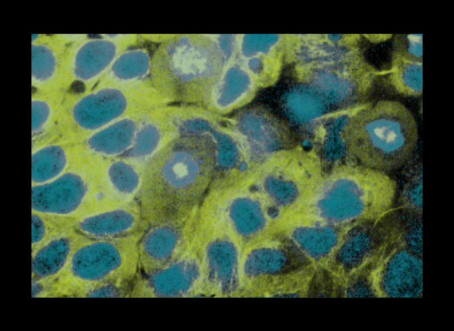
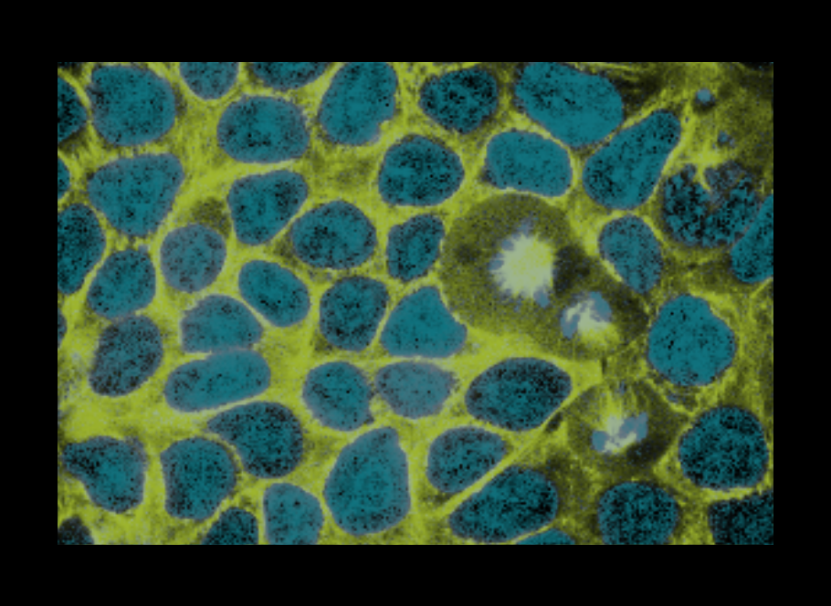
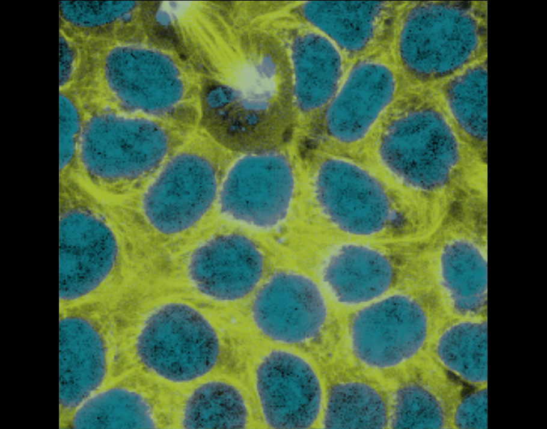

---
author:
- |
  Kyle Morrison\
  06/22/20
title: |
  Student Performance on BIOL12\
  Lab Module 3, Part 2
---

### Refresher: Stages of Mitosis

Retrieved from https://bitesizebio.com. Species unknown, but illustrates
the point.

### Lab Module 3 - Using the Allen Insitute 3D Cell Viewer

-   Across 50 images, tally hIPSCs in Interphase and in each stage of
    mitosis.

-   Don't count cells not fully in view.

-   Do count cells in telophase as *one* cell.

### Lab Module 3 - Using the Allen Insitute 3D Cell Viewer

### Analysis Methodology

1.  Aggregate all usable student data ($n = 82$).

2.  Plot the average counts (with standard deviations) vs cell cycle
    phase for each image (50 bar charts!).

3.  Plot overall average counts (with standard deviations) vs cell cycle
    phase.

4.  Plot average residual magnitude (how far off the answer key were the
    students?) vs image number for each cell cycle phase.

5.  Examine images students were the most off on.

### Overall Average Counts (All Phases)

0.35

-   Yellow Line - Answer Key values.

-   Students were more conservative in identifying Interphase.

0.65

### Overall Average Counts (Mitotic Phases)

0.35

-   Yellow Line - Answer Key values.

-   Students didn't get worse as the assignment went on (cool!).

-   Prophase and Prometaphase have the most false positives.

-   Metaphase and Prometaphase are often confused (compare averages
    around Image 30).

0.65

### Overall Residual Magnitude (All Phases)

0.35

-   Again, lots of variability in Interphase, particularly at Image 20
    (more on this later).

0.65

### Overall Residual Magnitude (Mitotic Phases)

0.35

-   Unsurprisingly, Prophase has the largest standard deviations.

-   Anaphase is the phase the students did the best on.

-   4 bars around Image 15 are almost identical for Prometaphase and
    Metaphase, further evidence students are mixing them up (more on
    this later).

0.65

### Hardest Images: Interphase (Image 20)

0.35

-   Looks like it might've given the students trouble just because there
    are a LOT of cells in view.

0.65

### Hardest Images: Interphase (Image 20)

0.35

-   Looks like it might've given the students trouble just because there
    are a LOT of cells in view.

0.65

### Hardest Images: Prophase (Image 16)

0.35

-   The answer key missed identifying the Prophase on the right, and the
    students might have picked up on this one, missed it, identified the
    Prometaphase as Prophase, or some combination.

0.65

### Hardest Images: Prophase (Image 16)

0.35

-   Looks more like misclassification based on the raw data, given both
    vary a lot here.

0.65

### Hardest Images: Prometaphase (Image 17)

0.35

-   The answer key says Metaphase, but this looks like Prometaphase,
    which is presumably what the students said.

0.65

### Hardest Images: Prometaphase (Image 17)

0.35

-   Looking at the raw data, it's not clear what happened. Perhaps
    Anaphase and Telophase mixups combined with Prophase/\
    Prometaphase/\
    Metaphase mixups?

0.65

### Hardest Images: Metaphase (Image 37)

0.35

-   The answer key says Metaphase, but this looks like Prometaphase,
    which is presumably what the students said. The middle cell does
    look like it could be late prophase, though, with more like two
    yellow blobs than one.

0.65

### Hardest Images: Metaphase (Image 37)

0.35

-   Looks like the students called Prometaphase and Prophase a lot,
    which matches what the image looks like. Also some mixups of
    Anaphase/Telophase for good measure.

0.65

### Hardest Images: Anaphase (Image 11)

0.35

-   Looks like a classic case of "Anaphase or Telophase?"

0.65

### Hardest Images: Anaphase (Image 11)

0.35

-   Yup.

0.65

### Hardest Images: Telophase (Image 14)

0.35

-   Looks like a classic case of "Anaphase or Telophase?"

-   Perhaps the cell on the far right that has a bright yellow spot is
    prophase-like?

0.65

### Hardest Images: Telophase (Image 14)

0.35

-   Yup.

-   The data supports the idea that the students thought at least
    something in here was prophase (the answer key disagrees).

0.65

### Overall Results

-   Students were more conservative in identifying Interphase.

-   By difference from the answer key (residual magnitude), visual
    inspection, and my experience grading, the order of rising
    difficulty:\
    Anaphase, Telophase, Metaphase, Prometaphase, Prophase.

-   Interphase was "technically" the most difficult, but I'd chalk this
    up to being more stringent with counting than to misclassifying
    Interphase as, say, Prophase.

-   Even lab staff, experienced and new, can go back and forth on
    "proper" labeling. Real images $\ne$ diagrams.
